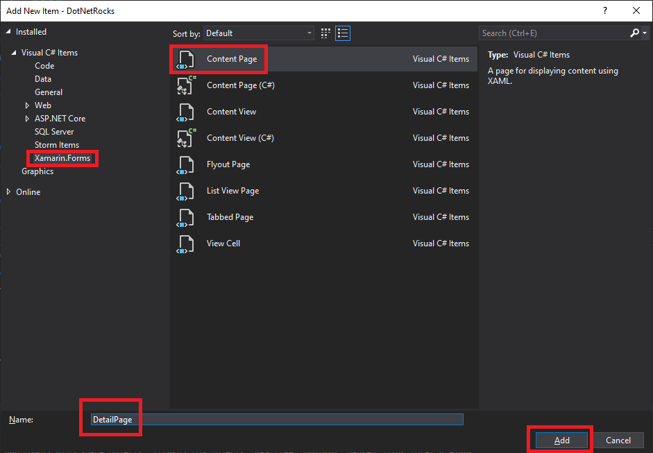

# The .NET Show Episode 6 

###### Building a Mobile Podcast App Part 4

See more projects at https://github.com/carlfranklin/DotNetShow

Watch the video at 

All episodes are listed at https://thedotnetshow.com

## Overview

Starting with episode 2 of The .NET Show, I am building a mobile podcast app for my podcast, .NET Rocks! using Xamarin Forms. 

At this point 

### Step 15 - Remove MobileDnr Projects

These three projects served their purpose. We pillaged the code from this simple project to get our Shell project, DotNetRocks, going.

- MobileDnr
- MobileDnr.Android
- MobileDnr.iOS

### Step 16 - Create a ShowDetails View

In the *DotNetRocks* project, right-click on the *Views* folder and select **Add -> New Item**, then select **Xamarin Forms** on the left, and **Content Page** in the list. Name it *DetailPage* and click the **Add** button



### Step 17 - Navigation

Before we start moving code, let's focus on the navigation. The Shell feature in Xamarin Forms makes it easy to do multi-level page navigation, providing a "back" buttons on each page you navigate to. You can even programmatically navigate to any view in the stack. More on that in a minute.

Add a new FlyoutItem to *AppShell.xaml* 

```xaml
<FlyoutItem Title="Details" Icon="icon_about.png">
    <ShellContent Route="DetailPage" ContentTemplate="{DataTemplate local:DetailPage}" />
</FlyoutItem>
```

This tells Xamarin Forms to recognize the DetailPage for shell navigation. But we have one more step, registration.

Change the constructor of *AppShell.xaml.cs*

```c#
public AppShell()
{
    InitializeComponent();
    Routing.RegisterRoute(nameof(HomePage), typeof(HomePage));
    Routing.RegisterRoute(nameof(DetailPage), typeof(DetailPage));
}
```

Those last two lines of code register the name of the view with the type of the view. Now we are ready to navigate.

### Step 18 - Create a new ViewModel for DetailPage

### Add a new class file to the *ViewModels* folder named *DetailPageViewModel.cs*

```c#
using System;
using System.Collections.Generic;
using System.Text;
using MvvmHelpers;
using System.Windows.Input;
using MvvmHelpers.Commands;
using MediaManager;
using System.Threading.Tasks;
using MonkeyCache.FileStore;
using System.IO;
using System.Net;
using Xamarin.Essentials;
using DotNetRocks.Models;

namespace DotNetRocks.ViewModels
{
    public class DetailPageViewModel : BaseViewModel
    {
        string CacheDir = "";
        string CachedFileName = "";
        string Mp3FileName = "";
        FileStream LocalFileStream = null;

        public DetailPageViewModel()
        {
            Barrel.ApplicationId = "mobile_dnr";
            CacheDir = FileSystem.CacheDirectory;
            CrossMediaManager.Current.PositionChanged += Current_PositionChanged;
            CrossMediaManager.Current.MediaItemFinished += Current_MediaItemFinished;
        }

        private Show currentShow;
        public Show CurrentShow
        {
            get
            {
                return currentShow;
            }
            set
            {
                SetProperty(ref currentShow, value);
                var uri = new Uri(CurrentShow.ShowDetails.File.Url);
                string DirectoryName = uri.Segments[uri.Segments.Length - 3];
                string FileNameOnly = Path.GetFileName(CurrentShow.ShowDetails.File.Url);
                Mp3FileName = DirectoryName.Substring(0, DirectoryName.Length - 1)
                        + FileNameOnly;
                CachedFileName = Path.Combine(CacheDir, Mp3FileName);
                // Does the file exist?
                if (System.IO.File.Exists(CachedFileName))
                {
                    // Yes! We are cached
                    IsCached = true;
                }
            }
        }

        private void Current_PositionChanged(object sender, MediaManager.Playback.PositionChangedEventArgs e)
        {
            TimeSpan currentMediaPosition = CrossMediaManager.Current.Position;
            TimeSpan currentMediaDuration = CrossMediaManager.Current.Duration;
            TimeSpan TimeRemaining = currentMediaDuration.Subtract(currentMediaPosition);
            if (IsPlaying)
            {
                if (TimeRemaining.Hours == 0)
                {
                    CurrentStatus = $"Time Remaining: {TimeRemaining.Minutes:D2}:{TimeRemaining.Seconds:D2}";
                }
                else
                {
                    CurrentStatus = $"Time Remaining: {TimeRemaining.Hours:D2}:{TimeRemaining.Minutes:D2}:{TimeRemaining.Seconds:D2}";
                }
            }
        }

        private void Current_MediaItemFinished(object sender, MediaManager.Media.MediaItemEventArgs e)
        {
            CurrentStatus = "";
            IsPlaying = false;
            if (LocalFileStream != null)
            {
                LocalFileStream.Dispose();
            }
        }

        private bool isPlaying;
        public bool IsPlaying
        {
            get
            {
                return isPlaying;
            }
            set
            {
                SetProperty(ref isPlaying, value);
            }
        }

        private ICommand play;
        public ICommand Play
        {
            get
            {
                if (play == null)
                {
                    play = new AsyncCommand(PerformPlay);
                }

                return play;
            }
        }


        public void DownloadFile()
        {
            var Uri = new Uri(CurrentShow.ShowDetails.File.Url);

            WebClient webClient = new WebClient();
            using (webClient)
            {
                webClient.DownloadDataCompleted += (s, e) =>
                {
                    try
                    {
                        System.IO.File.WriteAllBytes(CachedFileName, e.Result);
                        IsCached = true;
                    }
                    catch (Exception ex)
                    {
                        var msg = ex.Message;
                    }
                };

                webClient.DownloadDataAsync(Uri);
            }
        }

        private async Task PerformPlay()
        {
            IsPlaying = true;
            

            if (!IsCached)
            {
                // Not in cache. Play from URL
                CurrentStatus = "Downloading...";
                await CrossMediaManager.Current.Play(CurrentShow.ShowDetails.File.Url);
                // Download the file to the cache
                DownloadFile();
            }
            else
            {
                // In the cache. Play local file
                CurrentStatus = "Playing from Cache...";
                LocalFileStream = System.IO.File.OpenRead(CachedFileName);
                await CrossMediaManager.Current.Play(LocalFileStream, Mp3FileName);
            }
        }

        private ICommand stop;
        public ICommand Stop
        {
            get
            {
                if (stop == null)
                {
                    stop = new AsyncCommand(PerformStop);
                }
                return stop;
            }
        }

        public async Task PerformStop()
        {
            IsPlaying = false;
            CurrentStatus = "";
            await CrossMediaManager.Current.Stop();

            if (LocalFileStream != null)
            {
                LocalFileStream.Dispose();
            }
        }


        private string currentStatus;
        public string CurrentStatus
        {
            get => currentStatus;
            set => SetProperty(ref currentStatus, value);
        }

        private bool isCached;
        public bool IsCached
        {
            get => isCached;
            set => SetProperty(ref isCached, value);
        }
    }
}
```

The `HomePage` view is giving up all the code to download and play a podcast episode. You can see that the `DetailPage` is taking over that responsibility. Also note that we've added a `CurrentShow` property. All of the information about the show we're displaying is in there, including the URL to the MP3 file.

So, we've modified the `Play` command and the `PerformPlay` method, and the `DownloadFile` method to not take a URL argument, instead getting the URL from `CurrentShow.ShowDetails.File.Url`

We also changed the access level of the `PerformStop` method to `public` so we can call it when we navigate back to the `HomePage` view.

Other changes include fixing a bug in the caching logic. Most of the time you can count on the filename at the end of a Url to be unique. In the case of .NET Rocks!, all of the mp3 files are called *stream.mp3*. It's their subfolder that's unique. Consider this URL to episode 1744:

```
https://stream.redcircle.com/episodes/263338cf-4f97-4cff-8803-3ad49e15713b//stream.mp3
```

So, I've changed the code to make the filename a combination of the folder name and stream.mp3:

```
"263338cf-4f97-4cff-8803-3ad49e15713bstream.mp3"
```

The `CachedFileName` string is set in the `CurrentShow` property Setter. This happens on navigation.

```c#
private Show currentShow;
public Show CurrentShow
{
    get
    {
        return currentShow;
    }
    set
    {
        SetProperty(ref currentShow, value);
        var uri = new Uri(CurrentShow.ShowDetails.File.Url);
        string DirectoryName = uri.Segments[uri.Segments.Length - 3];
        string FileNameOnly = Path.GetFileName(CurrentShow.ShowDetails.File.Url);
        Mp3FileName = DirectoryName.Substring(0, DirectoryName.Length - 1)
            + FileNameOnly;
        CachedFileName = Path.Combine(CacheDir, Mp3FileName);
        // Does the file exist?
        if (System.IO.File.Exists(CachedFileName))
        {
            // Yes! We are cached
            IsCached = true;
        }
    }
}
```

I added a `Mp3FileName` string variable so that the `PerformPlay` method can load it from the cache. See, the `CachedFileName` is the local file name including the cache path, but the `CrossMediaManager` requires just the filename without the cache path.

Another bug I fixed was around the "Time Remaining" display, which was only showing minutes and seconds. This particular episode was over an hour, so I added a little logic to fix that issue:

```c#
private void Current_PositionChanged(object sender,
        MediaManager.Playback.PositionChangedEventArgs e)
{
    TimeSpan currentMediaPosition = CrossMediaManager.Current.Position;
    TimeSpan currentMediaDuration = CrossMediaManager.Current.Duration;
    TimeSpan TimeRemaining = currentMediaDuration.Subtract(currentMediaPosition);
    if (IsPlaying)
    {
        if (TimeRemaining.Hours == 0)
        {
            CurrentStatus = $"Time Remaining: {TimeRemaining.Minutes:D2}:{TimeRemaining.Seconds:D2}";
        }
        else
        {
            CurrentStatus = $"Time Remaining: {TimeRemaining.Hours:D2}:{TimeRemaining.Minutes:D2}:{TimeRemaining.Seconds:D2}";
        }
    }
}
```

### Step 19 - Fill out the `DetailPage` view

Replace the default XAML in *DetailPage.xaml* with the following:

```xaml
<?xml version="1.0" encoding="utf-8" ?>
<ContentPage xmlns="http://xamarin.com/schemas/2014/forms"
             xmlns:x="http://schemas.microsoft.com/winfx/2009/xaml"
             xmlns:local="clr-namespace:DotNetRocks"
             xmlns:viewmodels="clr-namespace:DotNetRocks.ViewModels"
             x:Class="DotNetRocks.Views.DetailPage">

    <ContentPage.BindingContext>
        <viewmodels:DetailPageViewModel/>
    </ContentPage.BindingContext>

    <ContentPage.Resources>
        <local:InverseBoolConverter x:Key="InverseBoolConverter"/>
    </ContentPage.Resources>

    <ContentPage.Content>
        <StackLayout Margin="20">
            <Label Text="{Binding CurrentShow.ShowTitle}"
                FontSize="Title"
                VerticalOptions="Start" 
                HorizontalOptions="CenterAndExpand" />
            <Button Text="Play"
                        IsVisible="{Binding IsPlaying, 
                            Converter={StaticResource InverseBoolConverter}}"
                        Command="{Binding Play}" />
            <Button Text="Stop" 
                        IsVisible="{Binding IsPlaying}" 
                        Command="{Binding Stop}" />
            <Label IsVisible="{Binding IsPlaying}" Text="{Binding CurrentStatus}" />
            <StackLayout Orientation="Horizontal">
                <Label Text="{Binding CurrentShow.ShowNumber}" />
                <Label Text="{Binding CurrentShow.DatePublished, StringFormat='Published {d}'}" />
            </StackLayout>
            <Label Text="{Binding CurrentShow.Description}" />

        </StackLayout>
    </ContentPage.Content>
</ContentPage>
```

Since our binding context (`DetailViewModel`) has only one show attached to it, the binding is much more simple. `DetailViewModel` has an `IsPlaying` property, a `Play` command and a `Stop` command, but most of the bound values come from the `CurrentShow` property. Now the key is to populate that `CurrentShow` property based on the `ShowNumber`, which will come from the `HomePage` view, which we will get to shortly.

### Step 20 - DetailPage ShowNumber Parameter

The DetailPage needs to know the ShowNumber so it can download all the details, which will be displayed. 

Shell pages can accept parameters just like web pages can, but you have to do a little plumbing to make that happen. Let's modify the *DetailPage.xaml.cs* file, the code-behind file for *DetailPage.xaml*. Note, this is not the ViewModel.

```c#
using System;
using System.Collections.Generic;
using System.Linq;
using System.Text;
using System.Threading.Tasks;
using Xamarin.Forms;
using Xamarin.Forms.Xaml;
using DotNetRocks.Services;
using DotNetRocks.ViewModels;

namespace DotNetRocks.Views
{
    [XamlCompilation(XamlCompilationOptions.Compile)]
    [QueryProperty(nameof(ShowNumber), nameof(ShowNumber))]
    public partial class DetailPage : ContentPage
    {
        public string ShowNumber { get; set; }
        ApiService ApiService = new ApiService();

        public DetailPage()
        {
            InitializeComponent();
        }

        protected override async void OnAppearing()
        {
            base.OnAppearing();
            int.TryParse(ShowNumber, out int result);
            var viewModel = (DetailPageViewModel)BindingContext;
            viewModel.CurrentShow = await ApiService.GetShowWithDetails(result);
        }
        
        protected override async void OnDisappearing()
        {
            var viewModel = (DetailPageViewModel)BindingContext;
            await viewModel.PerformStop();
        }
    }
}
```

The first thing you probably notice is this attribute:

```c#
[QueryProperty(nameof(ShowNumber), nameof(ShowNumber))]
```

This accepts two strings, one for the name and the other for the query id. Turns out these are both "ShowNumber", but for flexibility, I'm using the `nameof()` keyword to resolve the name of the `ShowNumber` String Property. Parameters must be strings.

The real magic happens in the `OnAppearing()` method, which we are overriding from the base `ContentPage`. 

```c#
protected override async void OnAppearing()
{
    base.OnAppearing();
    int.TryParse(ShowNumber, out int result);
    var viewModel = (DetailPageViewModel)BindingContext;
    viewModel.CurrentShow = await ApiService.GetShowWithDetails(result);
}
```

By the time this method occurs, the `BindingContext` is already set to an instance of `DetailPageViewModel` but we have to cast it as such to access the `CurrentShow` property, which we are setting to the result of `GetShowWithDetails` in the `ApiService`. 

Let's add that method now. Add this method to *ApiService.cs*, which is in the *Services* folder:

```c#
public async Task<Show> GetShowWithDetails(int ShowNumber)
{
    string Url = $"{ShowName}/{ShowNumber}/getwithdetails";
    var result = await httpClient.GetAsync(Url);
    result.EnsureSuccessStatusCode();
    var response = await result.Content.ReadAsStringAsync();
    return JsonConvert.DeserializeObject<Show>(response);
}
```

This call to the API returns a show with all the details filled in. 

The next thing you'll notice is that we can automatically stop playing when we navigate back to the `HomePage` view:

```c#
protected override async void OnDisappearing()
{
    var viewModel = (DetailPageViewModel)BindingContext;
    await viewModel.PerformStop();
}
```

Without this little trick, navigating to and from different shows could be quite cacophonous. 

At this point `DetailPageViewModel`'s `CurrentShow` property is set and ready to go.

### Step 21 - Update the HomePageViewModel

Now let's rewrite the `HomePageViewModel` to strip out all the playing stuff, and add a command to navigate to the `DetailPage` view:

```c#
using System;
using System.Collections.Generic;
using System.Windows.Input;
using System.Threading.Tasks;
using System.Linq;
using Xamarin.Forms;
using MvvmHelpers;
using MvvmHelpers.Commands;
using DotNetRocks.Services;
using DotNetRocks.Models;
using DotNetRocks.Views;

namespace DotNetRocks.ViewModels
{
    public class HomePageViewModel : BaseViewModel
    {
        private ApiService ApiService = new ApiService();
        public List<int> ShowNumbers { get; set; } = new List<int>();
        public int RecordsToRead { get; set; } = 20;
        public int LastShowNumber { get; set; }

        public HomePageViewModel()
        {
            var t = Task.Run(() => GetNextBatchOfShows());
            t.Wait();
        }

        public async Task GetNextBatchOfShows()
        {
            if (ShowNumbers.Count == 0)
            {
                ShowNumbers = await ApiService.GetShowNumbers();
                if (ShowNumbers == null || ShowNumbers.Count == 0) return;
                LastShowNumber = ShowNumbers.First<int>() + 1;
            }

            var request = new GetByShowNumbersRequest()
            {
                ShowName = "dotnetrocks",
                Indexes = (from x in ShowNumbers 
                           where x < LastShowNumber 
                           && x > (LastShowNumber - RecordsToRead) select x).ToList()
            };

            var nextBatch = await ApiService.GetByShowNumbers(request);
            if (nextBatch == null || nextBatch.Count == 0) return;

            AllShows.AddRange(nextBatch);
            LastShowNumber = nextBatch.Last<Show>().ShowNumber;
        }

        public async Task NavigateToDetailPage(int ShowNumber)
        {
            var route = $"{nameof(DetailPage)}?ShowNumber={ShowNumber}";
            await Shell.Current.GoToAsync(route);
        }

        private ICommand goToDetailsPage;
        public ICommand GoToDetailsPage
        {
            get
            {
                if (goToDetailsPage == null)
                {
                    goToDetailsPage = new AsyncCommand<int>(NavigateToDetailPage);
                }
                return goToDetailsPage;
            }
        }

        private ICommand loadMoreShows;
        public ICommand LoadMoreShows
        {
            get
            {
                if (loadMoreShows == null)
                {
                    loadMoreShows = new AsyncCommand(GetNextBatchOfShows);
                }
                return loadMoreShows;
            }
        }

        private List<Show> allShows = new List<Show>();
        public List<Show> AllShows
        {
            get => allShows;
            set => SetProperty(ref allShows, value);
        }

    }
}
```

All the stuff around playing and caching is gone, and we added this:

```c#
public async Task NavigateToDetailPage(int ShowNumber)
{
    var route = $"{nameof(DetailPage)}?ShowNumber={ShowNumber}";
    await Shell.Current.GoToAsync(route);
}

private ICommand goToDetailsPage;
public ICommand GoToDetailsPage
{
    get
    {
        if (goToDetailsPage == null)
        {
            goToDetailsPage = new AsyncCommand<int>(NavigateToDetailPage);
        }
        return goToDetailsPage;
    }
}
```

We've added a `GoToDetailsPage` command as an `AsyncCommand<int>` because it accepts the `ShowNumber` as an `int` type. That command calls the `NavigateToDetailPage` method, passing the `ShowNumber`. So the magic here comes down to the route:

```c#
var route = $"{nameof(DetailPage)}?ShowNumber={ShowNumber}";
```

Just like with a web Url, we're using the question mark to indicate a name/value pair is being passed. The name is "ShowNumber" and the value is the `ShowNumber` that was passed in. Then, we tell the Shell to navigate to that route:

```c#
await Shell.Current.GoToAsync(route);
```

To read more about Xamarin.Forms Shell routing, visit this URL:

https://docs.microsoft.com/en-us/xamarin/xamarin-forms/app-fundamentals/shell/navigation

### Step 22 - Update the HomePage view

Replace the contents of *HomePage.xaml* with the following:

```xaml
<?xml version="1.0" encoding="utf-8" ?>
<ContentPage xmlns="http://xamarin.com/schemas/2014/forms"
             xmlns:x="http://schemas.microsoft.com/winfx/2009/xaml"
             x:Class="DotNetRocks.Views.HomePage"
             xmlns:local="clr-namespace:DotNetRocks"
             xmlns:viewmodels="clr-namespace:DotNetRocks.ViewModels"
             xmlns:dxcv="http://schemas.devexpress.com/xamarin/2014/forms/collectionview"
             >

    <ContentPage.BindingContext>
        <viewmodels:HomePageViewModel/>
    </ContentPage.BindingContext>

    <ContentPage.Content>
        <StackLayout>
            <Label Margin="0,20,0,0"
                Text=".NET Rocks! Podcast Client"
                FontSize="Title"
                VerticalOptions="StartAndExpand" 
                HorizontalOptions="CenterAndExpand" />
            <dxcv:DXCollectionView x:Name="MyCollectionView" 
                               ItemsSource="{Binding AllShows}">
                <dxcv:DXCollectionView.ItemTemplate>
                    <DataTemplate>
                        <StackLayout>
                            <Label Text="{Binding ShowTitle}" FontSize="Large"/>
                            <StackLayout Orientation="Horizontal">
                                <Label Text="{Binding ShowNumber}" />
                                <Label Text="{Binding DatePublished, StringFormat='Published {d}'}" />
                            </StackLayout>
                            <Label Text="{Binding Description}" />
                            <Button Text="Episode Details"
                                    Command="{Binding GoToDetailsPage,
                                    Source={RelativeSource AncestorType={x:Type viewmodels:HomePageViewModel}}}"
                                    CommandParameter="{Binding ShowNumber}" />
                        </StackLayout>
                    </DataTemplate>
                </dxcv:DXCollectionView.ItemTemplate>
                <dxcv:DXCollectionView.Margin>
                    <OnIdiom x:TypeArguments="Thickness" Phone="10,10,10,10" Tablet="71,0,0,0"/>
                </dxcv:DXCollectionView.Margin>
            </dxcv:DXCollectionView>
            <Button Text="Load More Shows"
                    Command="{Binding LoadMoreShows}" />
        </StackLayout>
    </ContentPage.Content>
</ContentPage>
```

By moving all the playing and caching code into the `DetailPage` view, we have simplified the `HomePage` view quite a bit. The big change is that our button no longer plays the selected mp3, but instead navigates to the `DetailPage` view passing the `ShowNumber` as a parameter:

```xaml
<Button Text="Episode Details"
   Command="{Binding GoToDetailsPage, 
   Source={RelativeSource AncestorType={x:Type viewmodels:HomePageViewModel}}}"
   CommandParameter="{Binding ShowNumber}" />
```

Since we've already wired this up, we are now ready to test it out! Here's what it looks like in the Android Emulator "Pixel 2 Pie 9.0 - API 28":


Click the **Episode Details** button and you should see something like this:


Press the **Play** button and the audio will start playing:


Now you can either press the **Stop** button, or you can click the **Back** button, the left-arrow in the top-left corner, to navigate back to the `HomePage` view.

That's where we will leave it for now.

